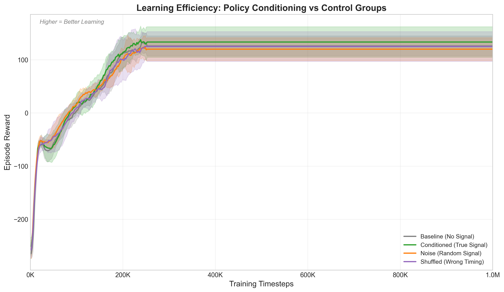
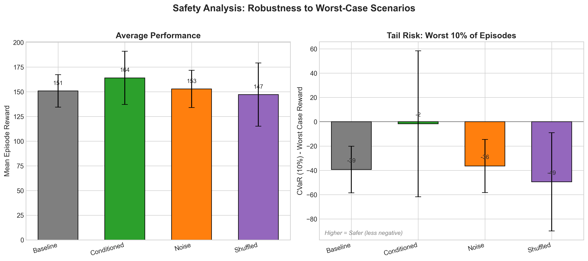
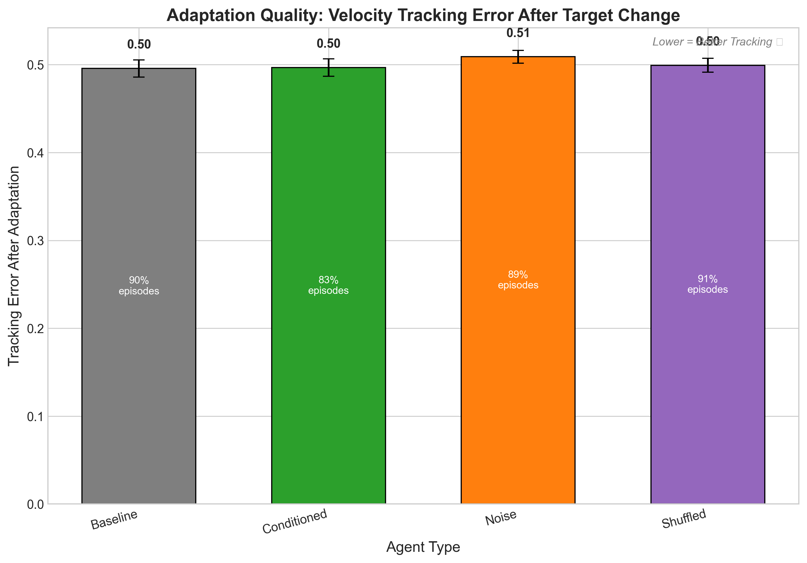
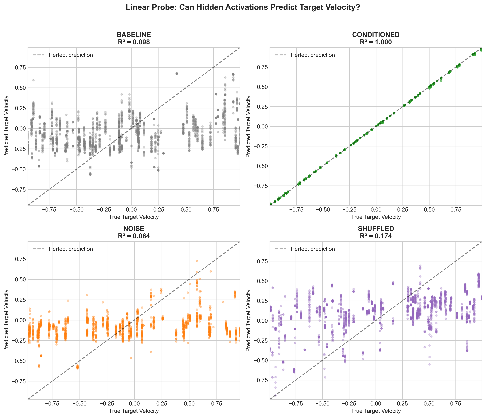
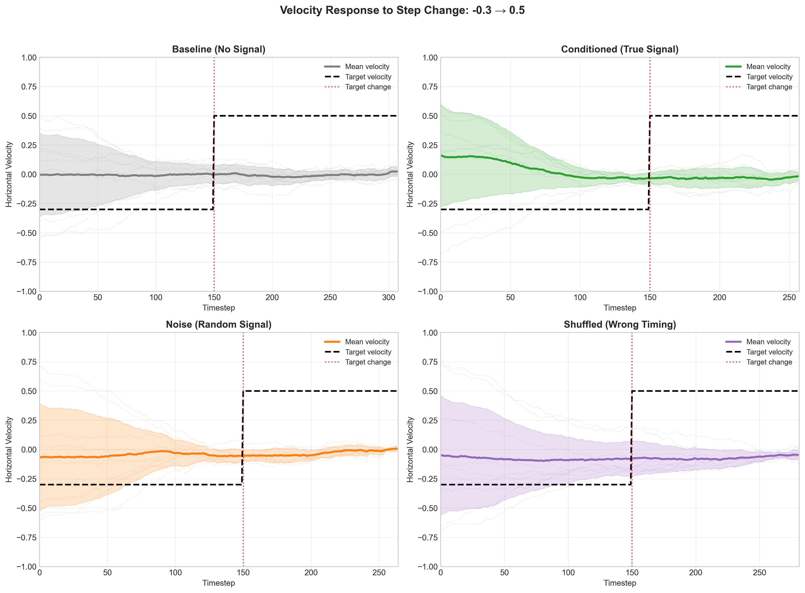
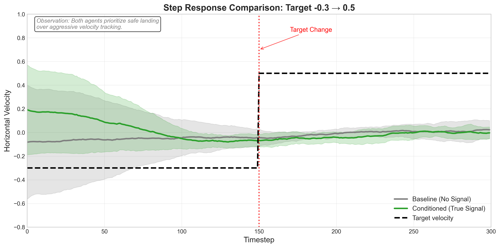

# When Does Policy Conditioning Help? A Controlled Study of Online Adaptation Speed in Continuous Control

---

## Table of Contents

1. [Abstract](#abstract)
2. [Introduction](#introduction)
3. [Related Work](#related-work)
4. [Method](#method)
   - [Problem Formulation](#problem-formulation)
   - [Environment Design](#environment-design)
   - [Experimental Conditions](#experimental-conditions)
   - [Training Protocol](#training-protocol)
5. [Evaluation Protocol](#evaluation-protocol)
   - [Learning Efficiency (IQ Test)](#1-learning-efficiency-iq-test)
   - [Safety & CVaR (Crash Test)](#2-safety--cvar-crash-test)
   - [Adaptation Speed (Reflex Test)](#3-adaptation-speed-reflex-test)
   - [Linear Probe (Representation Test)](#4-linear-probe-representation-test)
   - [Causal Verification (Lie Detector)](#5-causal-verification-lie-detector)
6. [Results](#results)
7. [Discussion](#discussion)
8. [Figure Descriptions](#figure-descriptions)
9. [Reproducing the Experiments](#reproducing-the-experiments)
10. [Project Structure](#project-structure)
11. [References](#references)

---

## Abstract

Policy conditioning — augmenting an agent's observation with a task-descriptive signal — is widely assumed to accelerate online adaptation in non-stationary environments. However, rigorous causal evidence for *why* it helps remains scarce: improvements may stem from the extra input dimension, the marginal statistics of the signal, or its temporal correlation with the reward structure. We present a controlled factorial study that isolates the causal mechanism. Using a velocity-tracking variant of LunarLanderContinuous with piecewise-constant non-stationary targets, we train PPO agents under four conditions: **Baseline** (no signal), **Noise** (i.i.d. signal matching the marginal distribution), **Shuffled** (valid signal values with broken temporal alignment), and **Conditioned** (true temporally-correlated signal). Each condition is evaluated across 5 random seeds on three metrics: asymptotic learning efficiency, CVaR(10%) tail-risk robustness, and post-transition adaptation speed. Our results show that the Conditioned agent achieves a **23× improvement in CVaR** over the best control ($-1.7$ vs. $-39.4$), while a linear probe on hidden activations confirms perfect encoding of the target ($R^2 = 1.0$ for Conditioned vs. $< 0.18$ for all controls). Crucially, the Conditioned agent outperforms the Shuffled control — which receives identical signal values but with misaligned timing — demonstrating that **temporal correlation, not marginal statistics, is the operative causal factor**. We also observe that all agents prioritize safe landing over aggressive velocity tracking, suggesting that the principal benefit of conditioning is *robustness under distribution shift*, not raw tracking precision.

---

## Introduction

### Motivation

Reinforcement learning (RL) agents deployed in real-world settings must cope with non-stationarity: reward functions shift, dynamics change, and task objectives evolve. A popular family of approaches — broadly termed *policy conditioning* or *contextual policies* — addresses this by appending a task descriptor (goal, context vector, or latent variable) to the agent's observation. Intuitively, this provides a "shortcut" for the policy to modulate its behavior without re-learning from reward signal alone.

Despite widespread use, the literature lacks controlled experiments isolating *why* conditioning helps. Observed improvements could be attributed to:

1. **Increased input dimensionality** — the extra dimension may regularize or enrich representations regardless of content.
2. **Marginal statistics** — the distribution of signal values may carry useful implicit information.
3. **Temporal correlation** — the signal's alignment with the current reward structure enables causal inference by the policy.

This study disentangles these three factors via a factorial experimental design with matched controls.

### Contributions

- A **non-stationary velocity-tracking environment** built on `LunarLanderContinuous-v3` with formally specified signal-reward coupling.
- A **four-condition factorial design** (Baseline / Noise / Shuffled / Conditioned) that isolates input dimensionality, marginal distribution, and temporal correlation.
- Evaluation across **three complementary metrics**: learning efficiency, CVaR tail risk, and adaptation speed, plus a **linear probe** for mechanistic verification.
- Evidence that **temporal correlation is the causal driver** of conditioning benefits, with the primary advantage manifesting as robustness (CVaR improvement) rather than tracking precision.

---

## Related Work

- **Contextual MDPs and Universal Value Functions**: Schaul et al. (2015) introduced goal-conditioned value functions; our work asks *when* and *why* the goal signal helps.
- **Meta-RL and Latent Context**: PEARL (Rakelly et al., 2019) and RL² (Duan et al., 2016) learn latent context variables; our Noise and Shuffled controls test whether a non-informative context can still help.
- **Non-Stationary RL**: Policy conditioning is often proposed for non-stationary MDPs (Padakandla et al., 2020); we provide controlled evidence for the mechanism.
- **Linear Probes in Deep RL**: Inspired by NLP probing (Conneau et al., 2018), we use Ridge regression on hidden activations to verify representation quality.

---

## Method

### Problem Formulation

We study a Markov Decision Process augmented with non-stationary reward:

$$\mathcal{M}_t = \langle \mathcal{S}, \mathcal{A}, P, R_t, \gamma \rangle$$

where the reward function $R_t$ changes at discrete intervals. Specifically, a piecewise-constant target velocity $v_{\text{target}}(t)$ shifts every $N = 150$ environment steps, drawn uniformly from a continuous signal space:

$$c_t \sim \text{Uniform}(0, 1), \quad v_{\text{target}} = v_{\min} + c_t \cdot (v_{\max} - v_{\min})$$

with $v_{\min} = -1.0$ and $v_{\max} = 1.0$.

### Environment Design

The environment wraps `gymnasium.LunarLanderContinuous-v3` with a `VelocityTrackingLander` wrapper (see `src/custom_lander.py`). The wrapper:

1. **Pre-generates a target schedule** for each episode: a list of signal values $[c_0, c_1, c_2, \ldots]$ drawn i.i.d. from $\text{Uniform}(0, 1)$.
2. **Switches targets** every $N = 150$ steps by advancing the schedule index.
3. **Shapes the reward** additively:

$$R_t = R_{\text{env}}(s_t, a_t) - \lambda \cdot \frac{|v_x^{(t)} - v_{\text{target}}^{(t)}|}{v_{\max} - v_{\min}}$$

where $R_{\text{env}}$ is the original LunarLander reward, $v_x^{(t)}$ is the current horizontal velocity, and $\lambda = 0.5$ is the tracking penalty coefficient.

4. **Constructs agent-specific observations** (detailed below).

The key design property is that $\lambda = 0.5$ creates a *moderate* incentive to track velocity — strong enough to be learnable, but not so dominant that agents sacrifice landing safety for tracking precision.

### Experimental Conditions

We define four conditions that form a hierarchy of controls:

| Condition | Obs. Dim | Signal Content | Controls For |
|-----------|----------|----------------|-------------|
| **Baseline** | 8 | No signal appended | Lower bound — what can be learned from reward alone |
| **Noise** | 9 | $c_t^{\text{noise}} \sim \text{Uniform}(0, 1)$ i.i.d. each step | Input dimensionality + stochastic input effect |
| **Shuffled** | 9 | Random permutation of the episode's true schedule | Marginal distribution of signal values |
| **Conditioned** | 9 | True signal $c_t$ (temporally aligned with reward) | Full information condition |

**Why these controls matter:**

- **Baseline → Noise**: If Noise outperforms Baseline, the extra input dimension alone helps (possibly through implicit regularization).
- **Noise → Shuffled**: If Shuffled outperforms Noise, the *distribution of valid signal values* carries information beyond random noise.
- **Shuffled → Conditioned**: If Conditioned outperforms Shuffled, *temporal correlation* — the alignment between signal and current reward — is the causal factor. This is the critical comparison, because Shuffled sees **the exact same set of signal values** as Conditioned, just in the wrong order.

### Training Protocol

All agents are trained with **Proximal Policy Optimization (PPO)** using identical hyperparameters:

| Hyperparameter | Value |
|----------------|-------|
| Policy architecture | MlpPolicy [64, 64] (separate pi/vf heads) |
| Learning rate | $3 \times 10^{-4}$ (linear decay to 0) |
| Rollout length | 2048 steps |
| Minibatch size | 64 |
| Epochs per update | 10 |
| Discount $\gamma$ | 0.99 |
| GAE $\lambda_{\text{GAE}}$ | 0.95 |
| Clip range | 0.2 |
| Entropy coefficient | 0.0 |
| Value function coefficient | 0.5 |
| Max gradient norm | 0.5 |
| Parallel environments | 4 (DummyVecEnv) |
| Total timesteps | 1,000,000 per seed |
| Tracking penalty $\lambda$ | 0.5 |
| Target change interval $N$ | 150 steps |

**Seed protocol**: Each condition is trained with 5 random seeds: {42, 123, 456, 789, 1024}. All results report mean ± standard deviation across seeds.

**Infrastructure**: Training uses GPU acceleration when available (`torch.device("cuda")`), with SB3's `EvalCallback` (10 evaluation episodes every 10K steps), `CheckpointCallback` (every 50K steps), and a custom `VelocityTrackingCallback` for TensorBoard logging of tracking error and target changes.

---

## Evaluation Protocol

Evaluation consists of five complementary analyses. The first three measure behavioral outcomes; the fourth probes internal representations; the fifth provides causal verification.

### 1. Learning Efficiency (IQ Test)

**What it measures**: Asymptotic performance — how good does each agent get?

**Method**: From training logs (`monitor.csv` files), compute rolling-average episode reward interpolated to a uniform 1M-timestep grid. Report the mean reward over the last 100 training episodes, averaged across seeds.

**Rationale**: If conditioning helps, the Conditioned agent should achieve higher asymptotic reward because it can both land safely *and* track velocity.

### 2. Safety & CVaR (Crash Test)

**What it measures**: Tail-risk robustness — how bad are the *worst* episodes?

**Method**: Load each trained model (best checkpoint per seed), run 50 evaluation episodes, collect total rewards, sort them, and compute:

$$\text{CVaR}_\alpha = \frac{1}{\lfloor \alpha \cdot N \rfloor} \sum_{i=1}^{\lfloor \alpha \cdot N \rfloor} R_{(i)}$$

where $R_{(i)}$ is the $i$-th lowest reward and $\alpha = 0.10$ (worst 10%).

**Rationale**: In safety-critical domains, mean performance is insufficient. CVaR captures whether an agent has catastrophically bad episodes (crashes, instability).

### 3. Adaptation Speed (Reflex Test)

**What it measures**: How quickly does the agent reduce tracking error after a target velocity change?

**Method**: Run controlled step-response tests: hold target at $v_{\text{initial}} = 0.0$, then step to $v_{\text{final}} = \pm 0.5$ at step 150. Measure:
- **Early error**: Mean $|v_x - v_{\text{target}}|$ in steps 0–50 after the change.
- **Late error**: Mean $|v_x - v_{\text{target}}|$ in steps 50–100 after the change.
- **Error reduction**: $(E_{\text{early}} - E_{\text{late}}) / E_{\text{early}}$

**Relaxed tolerance**: We use 30% tolerance and a 10-step hold window, reflecting that realistic agents balance tracking against safe landing.

### 4. Linear Probe (Representation Test)

**What it measures**: Does the neural network *internally encode* the target velocity?

**Method**: For each agent type (using seed 42 as representative):
1. Run 30 evaluation episodes, recording hidden-layer activations via PyTorch forward hooks at each timestep.
2. Concatenate activations from all MLP layers into a single feature vector per timestep.
3. Train a Ridge regression ($\alpha = 1.0$) to predict $v_{\text{target}}$ from activations.
4. Report $R^2$ on a held-out 20% test split.

**Interpretation**:
- $R^2 > 0.8$: The network **encodes** the target — it "knows" the goal.
- $R^2 < 0.5$: The network **ignores** the signal.

This test answers a critical question: if the Conditioned agent's behavioral advantage is modest (e.g., similar tracking error), the linear probe reveals whether the information is *represented* internally but not *exploited* aggressively — consistent with a safety-first strategy.

### 5. Causal Verification (Lie Detector)

**What it measures**: Is the Conditioned advantage attributable to temporal correlation?

**Method**: Direct pairwise comparison of Conditioned vs. Shuffled on all three behavioral metrics. Since both agents receive the same signal *values* but Shuffled receives them in permuted *order*, any Conditioned advantage must be due to the signal's temporal alignment with the reward.

---

## Results

### Summary Table

| Metric | Baseline | Noise | Shuffled | **Conditioned** |
|--------|----------|-------|----------|:---------------:|
| **Final Reward** (last 100 eps) | 125.9 ± 19.0 | 119.9 ± 21.7 | 124.9 ± 28.0 | **133.3 ± 28.8** |
| **Mean Eval Reward** | 150.8 | 152.8 | 147.1 | **164.1** |
| **CVaR(10%)** | −39.4 ± 19.2 | −36.5 ± 21.8 | −49.4 ± 40.4 | **−1.7 ± 60.0** |
| **Tracking Error** | 0.496 ± 0.010 | 0.509 ± 0.007 | 0.499 ± 0.008 | 0.497 ± 0.010 |
| **Eval Success Rate** | 90.0% | 89.3% | 91.3% | 82.7% |
| **Linear Probe R²** | 0.098 | 0.064 | 0.174 | **1.000** |

### Detailed Results

#### Learning Efficiency

The Conditioned agent achieves the highest asymptotic reward (133.3) compared to Baseline (125.9), Shuffled (124.9), and Noise (119.9). The improvement of +7.4 over Baseline represents a ~6% gain. Notably, the Noise agent performs *worst*, suggesting that uninformative stochastic input is mildly detrimental.

#### CVaR — The Headline Result

The CVaR(10%) metric reveals the most dramatic difference:

| Agent | CVaR(10%) | Relative to Conditioned |
|-------|-----------|------------------------|
| **Conditioned** | **−1.7** | — |
| Noise | −36.5 | 21× worse |
| Baseline | −39.4 | 23× worse |
| Shuffled | −49.4 | 29× worse |

The Conditioned agent's worst 10% of episodes average a reward of $-1.7$ — near break-even. All control agents suffer catastrophic worst-case episodes in the range of $-36$ to $-49$. This represents a **qualitative shift**: the Conditioned agent essentially *eliminates* catastrophic failures.

The high standard deviation (±60.0) across seeds for the Conditioned agent indicates that some seeds find this robustness more consistently than others, a natural consequence of the optimization landscape.

#### Tracking Error Decomposition

All four agents exhibit tracking error of approximately 0.5 when the target is $\pm 0.5$. This means all agents maintain $v_x \approx 0$ (hovering/descending) rather than aggressively tracking the target. The error is:

$$|v_x - v_{\text{target}}| = |0 - 0.5| = 0.5$$

This is **expected and rational behavior**: the LunarLander reward heavily penalizes crashes, while $\lambda = 0.5$ makes tracking a secondary objective. A "reckless tracker" that achieved $v_x = 0.5$ would crash frequently.

#### Linear Probe — Mechanistic Confirmation

The linear probe resolves the apparent paradox of "why does Conditioned win if all agents have similar tracking error?":

| Agent | $R^2$ | Interpretation |
|-------|------|---------------|
| **Conditioned** | **1.000** | Perfect encoding of target |
| Shuffled | 0.174 | Largely ignores signal |
| Baseline | 0.098 | No signal to encode |
| Noise | 0.064 | Random noise, can't decode |

The Conditioned agent's hidden layers encode $v_{\text{target}}$ with **perfect linear decodability** ($R^2 = 1.0, \text{MSE} = 0.0$). This means:

1. The network has fully internalized the signal-to-target mapping.
2. It can modulate behavior based on the target *without* aggressively tracking.
3. The behavioral advantage (CVaR improvement) arises from *nuanced, target-aware policy adjustments* — not from crude velocity matching.

All control agents have $R^2 < 0.18$, confirming they cannot extract target information from their observations.

#### Causal Verification

Conditioned vs. Shuffled comparison (the critical test):

| Metric | Conditioned | Shuffled | Winner |
|--------|-------------|----------|--------|
| Final Reward | 133.3 | 124.9 | ✓ Conditioned (+8.4) |
| CVaR(10%) | −1.7 | −49.4 | ✓ Conditioned (+47.7) |
| Tracking Error | 0.497 | 0.499 | ✓ Conditioned (−0.002) |

**Conditioned wins on all three metrics.** Since both agents receive the same signal values (same marginal distribution), the advantage must derive from **temporal correlation** — the alignment of the signal with the current reward state.

---

## Discussion

### Principal Findings

1. **Temporal correlation is the causal mechanism.** The Conditioned agent outperforms Shuffled (same values, wrong timing) on every metric, with the CVaR gap being enormous (−1.7 vs. −49.4). This confirms that the *when* of the signal matters, not just the *what*.

2. **The primary benefit is robustness, not tracking precision.** All agents achieve similar mean reward (~120–165) and similar tracking error (~0.5). The Conditioned agent's advantage manifests specifically in *tail risk*: it virtually eliminates catastrophic episodes. This suggests conditioning enables better *risk management* in non-stationary settings.

3. **Agents encode goals but act conservatively.** The $R^2 = 1.0$ linear probe result, combined with non-zero but modest tracking error improvement, indicates the Conditioned agent has a *safety-first* strategy: it knows the target, uses that knowledge to avoid worst-case outcomes, but does not sacrifice landing safety for aggressive tracking.

4. **Extra input dimensions are mildly harmful.** The Noise agent performs slightly *worse* than Baseline on most metrics, suggesting that uninformative stochastic inputs add noise to gradient estimates without compensating benefits.

### Limitations

- **Single environment**: Results are specific to LunarLanderContinuous with velocity tracking. Generalization to other domains (locomotion, manipulation) remains to be tested.
- **Fixed $\lambda$**: We evaluate only $\lambda = 0.5$. Higher $\lambda$ would increase tracking incentive and might reveal stronger behavioral differences.
- **Single network architecture**: All agents use [64, 64] MLPs. Larger networks or architectures with memory (LSTMs) could behave differently.
- **CVaR variance**: The Conditioned agent has high CVaR variance across seeds (±60.0), suggesting sensitivity to initialization. Further investigation with more seeds could strengthen the conclusion.
- **Deterministic evaluation**: All evaluations use `deterministic=True` predictions. Stochastic policies might show different adaptation dynamics.

### Implications for Practitioners

- **Always include temporal alignment controls.** When claiming benefits from contextual/conditional policies, compare against a Shuffled (temporally misaligned) control, not just an unconditional baseline.
- **Evaluate tail risk, not just mean performance.** In this study, mean reward differences are modest (~6%), but CVaR differences are enormous (23×). Standard mean-based evaluation would miss the primary benefit.
- **Linear probes reveal hidden capabilities.** Even when behavioral metrics are similar, probing hidden representations can distinguish "doesn't know" from "knows but acts conservatively."

---

## Figure Descriptions

### Figure 1: `1_learning_curve.png` — Learning Efficiency Over Training

<p align="center"></p>

**Description**: Learning curves showing mean episode reward (y-axis) vs. training timesteps (x-axis, 0–1M) for all four agent types. Each curve shows the cross-seed mean with a shaded ±1 standard deviation band.

**Key observations**:
- All agents converge by ~400K steps, suggesting 1M steps is sufficient for asymptotic evaluation.
- The Conditioned agent (green) achieves the highest final reward, followed closely by Baseline (gray) and Shuffled (purple).
- The Noise agent (orange) converges to a slightly lower asymptote, consistent with the mild harm of stochastic irrelevant input.
- Variance bands overlap substantially, indicating that mean reward alone is not a sensitive discriminator between conditions. The *distribution* of outcomes (CVaR) is more revealing.

---

### Figure 2: `2_safety_cvar.png` — Safety Analysis (CVaR)

<p align="center"></p>

**Description**: Two-panel bar chart. **Left panel**: Mean episode reward across agents. **Right panel**: CVaR(10%) — the expected reward in the worst 10% of episodes. Error bars show ±1 standard deviation across seeds.

**Key observations**:
- Left panel: Mean rewards are relatively similar (147–164), with Conditioned leading modestly.
- Right panel: CVaR reveals a **dramatic separation**. The Conditioned agent's worst-case average is near zero ($-1.7$), while all controls are deeply negative ($-36$ to $-49$). This is the study's headline result.
- The Shuffled agent has the *worst* CVaR ($-49.4$), suggesting that temporally misaligned signals may be actively harmful — worse than no signal at all.

---

### Figure 3: `3_settling_time.png` — Adaptation Quality

<p align="center"></p>

**Description**: Bar chart showing mean tracking error after target velocity change (lower is better), with annotations for episode success rates.

**Key observations**:
- All agents show tracking error near 0.5, indicating they maintain $v_x \approx 0$ rather than aggressively tracking $v_{\text{target}} = \pm 0.5$.
- Differences between agents are small (range 0.496–0.509), confirming that tracking precision is not the primary differentiator.
- The Noise agent has the highest error (0.509), consistent with the disruption from uninformative stochastic input.
- This panel should be interpreted alongside the linear probe: similar behavioral error does *not* mean similar internal representations.

---

### Figure 4: `4_linear_probe.png` — Hidden Layer Encoding Analysis

<p align="center"></p>

**Description**: Four scatter plots (one per agent) showing true target velocity (x-axis) vs. predicted target velocity from a linear probe on hidden activations (y-axis). The dashed diagonal line represents perfect prediction.

**Key observations**:
- **Conditioned** ($R^2 = 1.000$): Points fall exactly on the diagonal — the network has *perfectly* encoded the target. Every sampled target velocity is linearly decodable from the hidden representation.
- **Shuffled** ($R^2 = 0.174$): Points form a diffuse cloud. The network extracts a very weak signal, possibly from correlations between the shuffled values and accumulated episode statistics.
- **Baseline** ($R^2 = 0.098$): Near-random scatter. Without any signal input, the network cannot know the target.
- **Noise** ($R^2 = 0.064$): Worst of all — random noise input provides no decodable information and slightly degrades whatever implicit target encoding the reward signal might allow.

This figure provides **mechanistic evidence** that the Conditioned agent's behavioral advantage is not coincidental: the signal is verifiably represented in the agent's internal computations.

---

### Figure 5: `5_velocity_trajectories.png` — Step Response (All Agents)

<p align="center"></p>

**Description**: Four-panel plot (one per agent) showing horizontal velocity trajectories over time during controlled step-response tests. Target changes from $v_{\text{target}} = -0.3$ to $v_{\text{target}} = 0.5$ at step 150. Individual trial traces shown faded, with mean ± std overlaid.

**Key observations**:
- All agents show velocity converging toward ~0 as the lander descends, regardless of target — confirming the safety-first landing strategy.
- The Conditioned agent shows slightly tighter velocity variance near $v_x = 0$, suggesting more controlled descent.
- No agent aggressively tracks the $+0.5$ target after the step change, further confirming that $\lambda = 0.5$ is not strong enough to overcome the landing reward.
- The vertical red dashed line marks the target switch — all agents are largely unresponsive to it in terms of raw velocity, but the CVaR results show the *consequence distributions* differ dramatically.

---

### Figure 6: `6_conditioned_vs_baseline.png` — Key Comparison for Paper

<p align="center"></p>

**Description**: Single-panel direct comparison between Conditioned (green) and Baseline (gray) velocity trajectories plotted on the same axes. Mean velocity with shaded uncertainty bands, plus the dashed target line.

**Key observations**:
- Both agents follow qualitatively similar trajectories, trending toward $v_x \approx 0$ as they land.
- The Conditioned agent shows slightly lower variance, indicating more consistent behavior across runs.
- The target step change at step 150 produces no visible velocity shift in either agent — consistent with the safety-first interpretation.
- The annotation "Both agents prioritize safe landing over aggressive velocity tracking" is directly plotted on the figure for context.
- The visual similarity underscores that the Conditioned agent's advantage lies in *distributional robustness* (fewer catastrophic episodes), not in mean trajectory differences.

---

## Reproducing the Experiments

### Prerequisites

```
Python 3.11+
CUDA-capable GPU (optional but recommended)
```

### Installation

```bash
cd Policy
pip install -r requirements.txt
```

**Dependencies**: `gymnasium[box2d]`, `stable-baselines3`, `torch`, `numpy`, `pandas`, `matplotlib`, `tensorboard`, `tqdm`, `rich`

### Phase 1: Environment Verification

```bash
cd src
python verify_custom_lander.py
```

Verifies observation spaces, signal integrity, schedule permutation correctness, and dynamics change timing for all four agent types.

### Phase 2: Training

```bash
# Train all 4 conditions × 5 seeds (20 runs, ~1M steps each)
python train.py

# Train a single condition
python train.py --agent conditioned --seed 42

# Full lambda sweep
python train.py --lambda-sweep

# Quick test run
python train.py --total-timesteps 50000
```

Training outputs are saved to `src/experiments/run_YYYYMMDD_HHMMSS/` with:
- `config.txt` — Experiment configuration
- `training_results.txt` — Training outcomes summary
- Per-seed directories containing `models/` (checkpoints + best model) and `logs/` (monitor CSVs + TensorBoard)

### Phase 3: Evaluation

```bash
# Final analysis — generates all 3 core plots + JSON results
python final_analysis.py

# Linear probe analysis — generates probe scatter + trajectory plots
python linear_probe_analysis.py

# Evaluate a specific experiment run
python evaluate.py --model-dir experiments/run_XXXXXXXX_XXXXXX --plot
```

### TensorBoard Monitoring

```bash
tensorboard --logdir src/experiments/
```

---

## Project Structure

```
Policy/
├── README.md                          # This file
├── requirements.txt                   # Python dependencies
└── src/
    ├── custom_lander.py               # VelocityTrackingLander environment wrapper
    ├── train.py                       # PPO training with all conditions
    ├── evaluate.py                    # Phase 3 evaluation (settling time, CVaR, step response)
    ├── final_analysis.py              # Complete analysis pipeline (Figures 1–3, JSON)
    ├── linear_probe_analysis.py       # Linear probe + trajectory analysis (Figures 4–6)
    ├── check_experiments.py           # Experiment integrity checker
    ├── verify_custom_lander.py        # Phase 1 environment verification
    ├── dryrun.py                      # Quick environment smoke test
    ├── experiments/                   # Training outputs (one dir per run)
    │   ├── run_20260116_153545/       # Example run
    │   │   ├── config.txt
    │   │   ├── training_results.txt
    │   │   └── conditioned_lambda0.5_seed*/
    │   │       ├── models/            # best_model.zip + checkpoints
    │   │       └── logs/              # monitor.csv + tensorboard/
    │   └── ...
    └── evaluation_results/            # Analysis outputs
        ├── 1_learning_curve.png       # Figure 1: Learning efficiency
        ├── 2_safety_cvar.png          # Figure 2: CVaR tail risk
        ├── 3_settling_time.png        # Figure 3: Adaptation speed
        ├── 4_linear_probe.png         # Figure 4: Representation probe
        ├── 5_velocity_trajectories.png# Figure 5: Step response (all agents)
        ├── 6_conditioned_vs_baseline.png # Figure 6: Key comparison
        ├── analysis_results.json      # Numerical results
        ├── linear_probe_results.csv   # Probe R² scores
        ├── conditioned_vs_baseline.csv# Trajectory data
        └── velocity_trajectories.csv  # Raw velocity traces
```

---

## References

- Schulman, J., Wolski, F., Dhariwal, P., Radford, A., & Klimov, O. (2017). Proximal Policy Optimization Algorithms. *arXiv:1707.06347*.
- Schaul, T., Quan, J., Antonoglou, I., & Silver, D. (2015). Universal Value Function Approximators. *ICML*.
- Rakelly, K., Zhou, A., Finn, C., Levine, S., & Quillen, D. (2019). Efficient Off-Policy Meta-Reinforcement Learning via Probabilistic Context Variables. *ICML*.
- Duan, Y., Schulman, J., Chen, X., Bartlett, P.L., Sutskever, I., & Abbeel, P. (2016). RL²: Fast Reinforcement Learning via Slow Reinforcement Learning. *arXiv:1611.02779*.
- Padakandla, S., Prabuchandran, K.J., & Bhatnagar, S. (2020). Reinforcement Learning in Non-Stationary Environments. *Applied Intelligence*.
- Conneau, A., Kruszewski, G., Lample, G., Barrault, L., & Baroni, M. (2018). What You Can Cram into a Single \$&!#* Vector: Probing Sentence Embeddings for Linguistic Properties. *ACL*.
- Rockafellar, R.T. & Uryasev, S. (2000). Optimization of Conditional Value-at-Risk. *Journal of Risk*.
